<!-- Image-only GitHub profile. All visible content is rendered in SVG assets. -->

  <picture>
    <source media="(max-width: 600px)" srcset="assets/profile-hero-mobile.svg" />
    
  </picture>

  <a href="https://github.com/lordware">
  <picture>
    <source media="(max-width: 600px)" srcset="assets/profile-stats-mobile.svg" />
    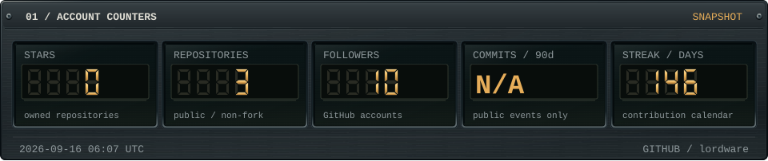
  </picture>
  </a>

  <picture>
    <source media="(max-width: 600px)" srcset="assets/profile-ticker-mobile.svg" />
    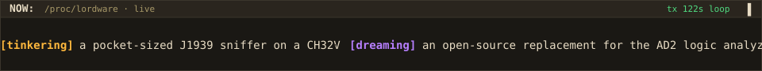
  </picture>

  <picture>
    <source media="(max-width: 600px)" srcset="assets/profile-bus-mobile.svg" />
    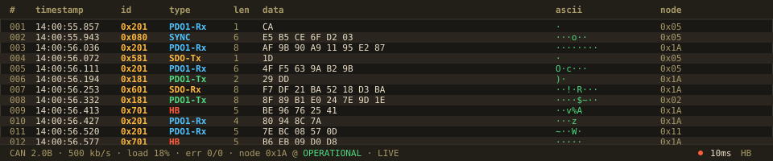
  </picture>

  <picture>
    <source media="(max-width: 600px)" srcset="assets/profile-scope-mobile.svg" />
    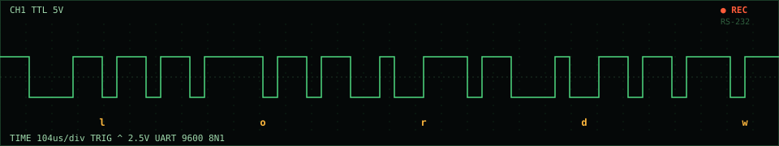
  </picture>

  <picture>
    <source media="(max-width: 600px)" srcset="assets/profile-boot-mobile.svg" />
    
  </picture>

  <picture>
    <source media="(max-width: 600px)" srcset="assets/profile-hexdump-mobile.svg" />
    
  </picture>

  <a href="https://github.com/lordware?tab=repositories">
  <picture>
    <source media="(max-width: 600px)" srcset="assets/profile-repos-mobile.svg" />
    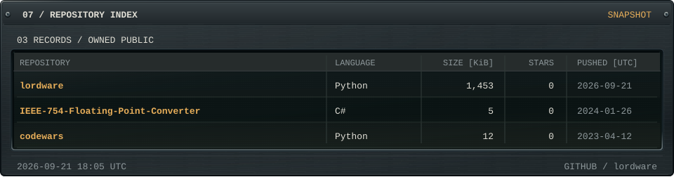
  </picture>
  </a>

  <picture>
    <source media="(max-width: 600px)" srcset="assets/profile-lang-mobile.svg" />
    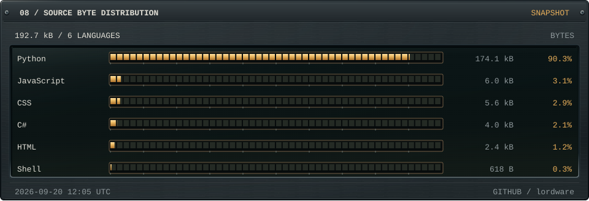
  </picture>

  <a href="https://github.com/lordware?tab=overview">
  <picture>
    <source media="(max-width: 600px)" srcset="assets/profile-syslog-mobile.svg" />
    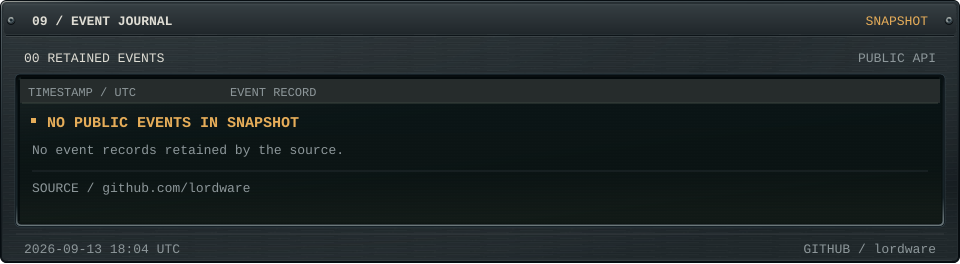
  </picture>
  </a>

  <picture>
    <source media="(max-width: 600px)" srcset="assets/profile-activity-mobile.svg" />
    
  </picture>

  <picture>
    <source media="(max-width: 600px)" srcset="assets/profile-visitors-mobile.svg" />
    
  </picture>

  <picture>
    <source media="(max-width: 600px)" srcset="assets/profile-connect-mobile.svg" />
    
  </picture>

  

